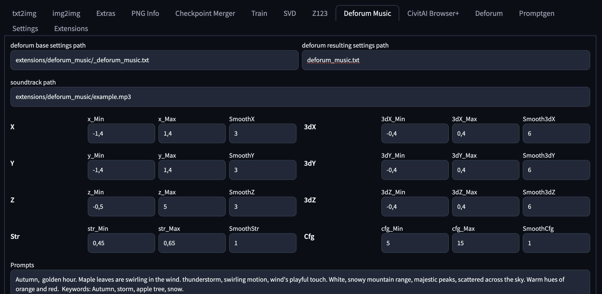

#### Deforum music

### A research project with the ambitious goal of automatically generating audio reactive video

#### mp32mp4
Notebook for generating deforum settings

#### sd-webui plugin (AUTO1111)

### algorithm:
I apply a bandpass filter,
split frequencies into bass/mid/high,
transform into wave functions (Fourier transform),
discard outliers beyond 3 sigma,
apply smoothing,
normalize to given values of fluctuations,
normalize by median where necessary,
calculate function breaks (second derivative),
apply corrective coefficients reducing minima at breaks.

### calculate:
prompt (break points),
config /strength (directly and inversely proportional to the amplitudes of the wave oscillations),
changes along all coordinates according to the wave functions (X, Y, Z, 3dX, 3dY).

### tldr;
It probably sounds complicated, but in short: you choose a track - press generate settings. You upload the settings to the deforum - press generate video.

Recommended model: https://civitai.com/models/185258/colorfulxl

### examples:
[examples](https://www.youtube.com/@babkasotona/videos)

### Project by [AiArtLab](https://aiartlab.org/)
